# Unity Introduction

In this meeting we will be discussing about introduction to Unity and Unity basic scripting. Unity is a powerful and popular game development platform that allows you to create interactive 2D and 3D applications, including games, simulations, virtual reality experiences, and more. It's known for its versatility and user-friendly interface, large community support, and cross-platform capabilities. Its accessibility, combined with powerful 2D and 3D capabilities, makes it a top choice for beginners and experienced developers alike. 

## Getting started with Unity

1. **Download and Install Unity**: Visit the Unity website (https://unity.com) to download and install the Unity Hub and Unity Editor.

2. **Create a Unity ID**: You'll need a Unity ID to access Unity services and the Unity Asset Store.

3. **Create a Project**: In this session we will be using Unity 3D (core) project as starter. Follow this step to create a project:
	- Open Unity Hub Application
	- Click "New Project" button
	- Fill out the name and path of the project on your computer
	- Click "Create Project"

### Workspace introduction

Unity's workspace consists of various panels and views. Here's an overview:

1. **Scene View**: This is where you design and arrange your game objects within a scene. You can move, rotate, and scale objects using the Scene View.

2. **Game View**: The Game View shows how your game will look and function in real-time. It's useful for testing and playing your game.

3. **Hierarchy**: The Hierarchy panel lists all the game objects in your scene. You can select and organize objects here.

4. **Inspector**: The Inspector panel displays details and properties of the selected game object or component. You can adjust settings and attach scripts here.

5. **Project**: The Project panel is where you manage your assets, including scripts, textures, models, and more. You can organize your project folders and assets here.

6. **Console**: The Console panel logs messages, errors, and warnings generated by your scripts. It's a crucial tool for debugging.

7. **Toolbar**: The Toolbar provides quick access to common tasks like running your game, saving your project, and more.

### How Unity works?

Unity operates on a component-based architecture, and understanding this basic structure is essential for creating games and interactive experiences:

1. **Game Objects**: Game objects are the fundamental building blocks of your Unity scenes. These objects can represent characters, items, scenery, cameras, lights, and more. Each game object is a container that holds components, which define its behavior and appearance.

   

3. **Components**: Components are individual units of functionality that can be attached to game objects. Unity provides a wide range of built-in components like colliders, rigidbodies, cameras, and lights, but you can also create custom components through scripting. Components define various aspects of a game object, such as its appearance, physics behavior, and interactivity.
   
   

5. **Scripts**: Unity commonly uses C# (or other supported languages like JavaScript or Boo) for scripting. Scripts allow you to add custom logic and behavior to your game objects. You can write scripts to control how a character moves, how enemies behave, how items are collected, and much more. The scripts can be attached to game objects as components.

   

6. **Scenes**: A scene is a container for your game objects. You can think of a scene as a level or a distinct part of your game. You can have multiple scenes in a Unity project, each representing different parts of your game. Scenes help organize and manage the complexity of larger games and interactive applications.

   

## Make your player move

1. First you'll need to create a player mover script for your player movement.
you can do that by clicking the add component button inside the inspector or create a script in the project and then adding that script to the player GameObject.

    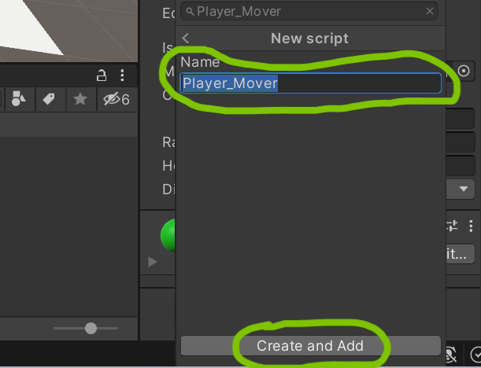

2. Next open the script by double clicking the script.

3. Inside the script you'll need to declaring the necessary variables that will control the player's movement. These variables typically include speed or any other factors that affect how the player moves. In this case, we are are only going to use speed.

    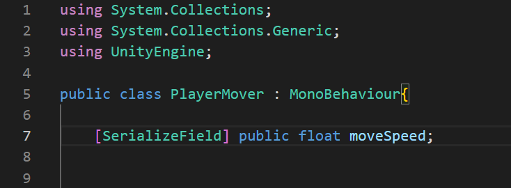

    ``[SerializeField]`` is an attribute in Unity's C# scripting that is used to make a private variable visible in the Unity Inspector, allowing you to set its value from the Unity Editor.

3. Next add ``CharacterController`` to the player gameObject.

    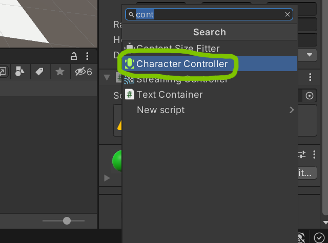

4. Next you need to you should obtain a reference to the ``CharacterController`` component that is attached to the player's GameObject. A CharacterController in Unity is a specialized component used for controlling the movement and physics interactions of a character or game object, typically in a 3D game.

    You can do it with two ways :
    First you can manually attach the component in the unity editor by making the CharacterController a SerializeField.

    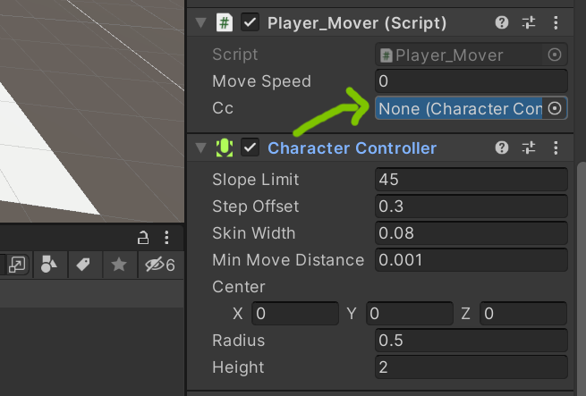

    Second, you can automaticly get the component from your game object using the ``getComponent`` method inside the ``start`` method.

    ``Start():`` Called at the beginning of the first frame when a script is enabled. It's often used for initial setup.

    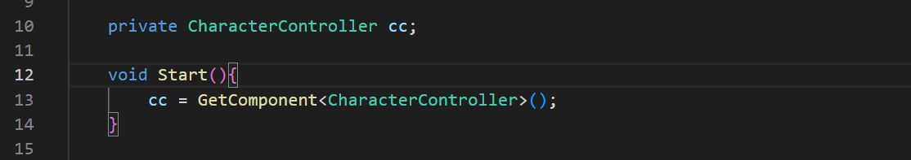

5. Next your script will need to be able to recieve input from the user (in this case keyboard). Using the Input.GetAxis with input vertical and horizontal in the update method you will be able to recieve up down left and right arrow key input from user.

   ``Update():`` Called once per frame and is commonly used for game logic that needs to run continuously (e.g., character movement).

    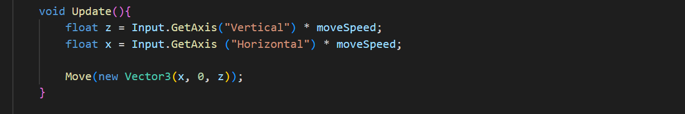

    ``Input.GetAxis`` : is a function in Unity that allows you to retrieve the current value of a specified input axis. 
    ``Input.GetAxis("Vertical")`` : retrieves the input from the "Vertical" axis, which is typically mapped to the W and S keys (or the Up and Down arrow keys). 
    ``Input.GetAxis("Horizontal")`` : retrieves the input from the "Horizontal" axis, typically mapped to the A and D keys (or the Left and Right arrow keys).

    ``moveSpeed`` represents the speed at which the game object should move.
    The result of this calculation, stored in the x and z variable. the x represents the desired movement in the left or right direction. the z represents the desired movement in the forward or backward direction.

6. Next create a method called move (you can named it as you wish). This method will takes a single parameter, dir, which is expected to be a Vector3.

    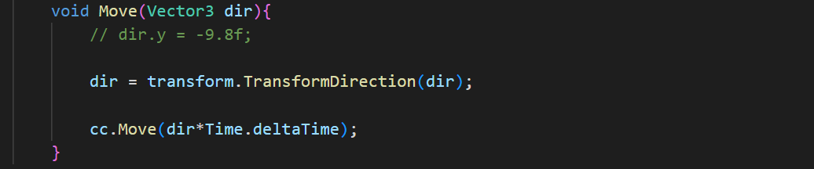

7. using transform.TransformDirection, dir vector will transforms from local space to global space. In Unity, objects have their local coordinate system, but the Move function of a CharacterController typically expects movement input in global space. By using transform.TransformDirection, the dir vector is converted from local to global space, ensuring that movement is applied correctly.

8. Then multipy the dir by Time.deltaTime. This will makes the movement frame-rate independent, ensuring that the object moves at a consistent rate regardless of the frame rate. 

Now you should be able to move your player.

## Make your player able to shoot

1. First create a sphere object for bullet gameObject in the hierarcy and give a red color to it by using material like before. After that resize the bullet to 0.1 or another size that you seem fit.
    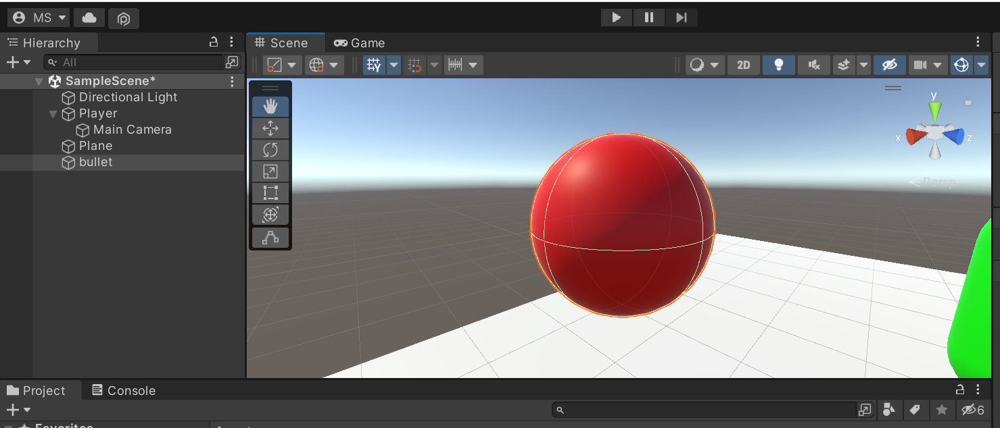

    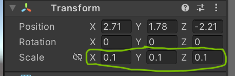

    After that put the bullet gameObject to the hierarchy by dragging the gameObject. You will have a prefab for bullet gameObject. In that way you can clone that object as much as you want without having to create the same gameObject all over again.

    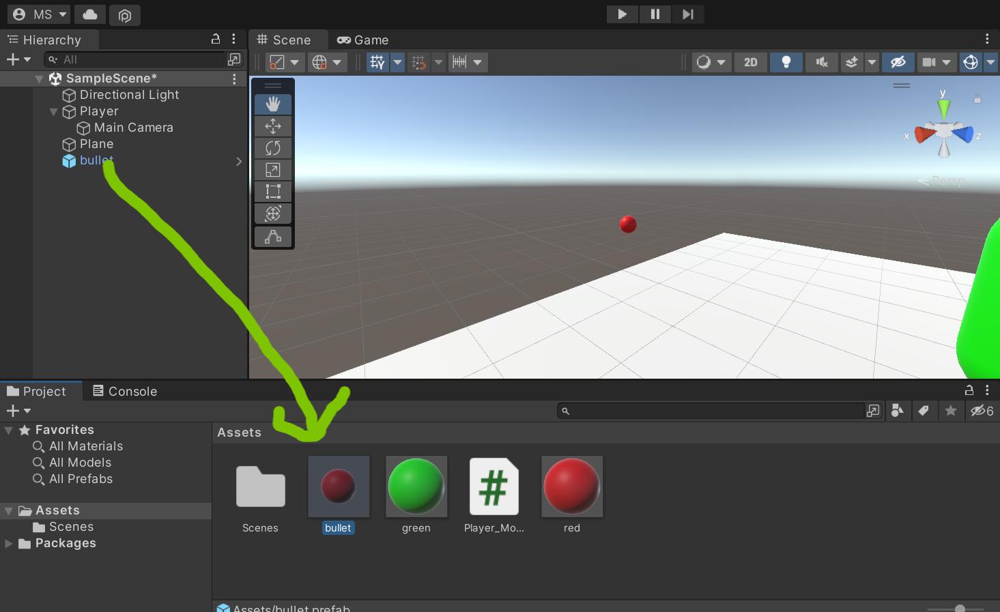

2. Next you'll need to create a transform position for your bullet to spawn. Put the transform gameObject inside the main Camera gameObject and set the position to align with  the muzzle of the pistol.

    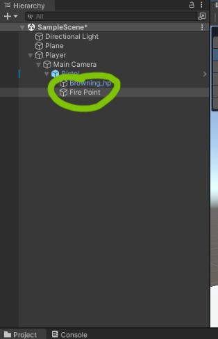
    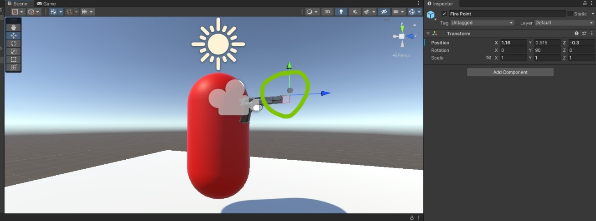

3. Next create a script PlayerShooter in the palyer gameObject. The script is responsible for managing the shooting behavior of the player character.

    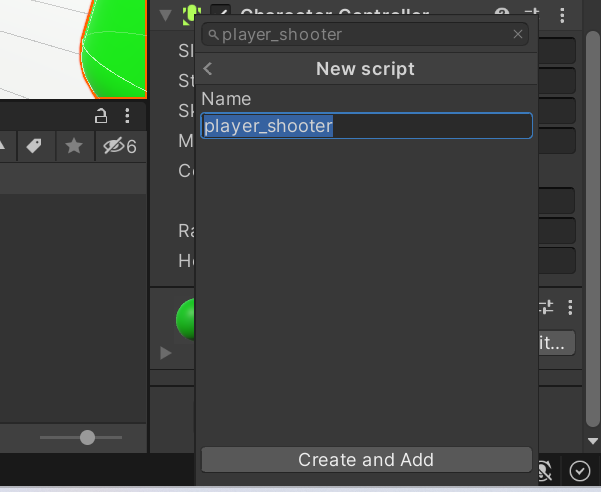

4. Next declare the variable for the behavior of the shot. BulletSpeed (the speed of the bullets), shootCooldown (the time delay between shots), and a private boolean canShoot to track whether the player is allowed to shoot.
    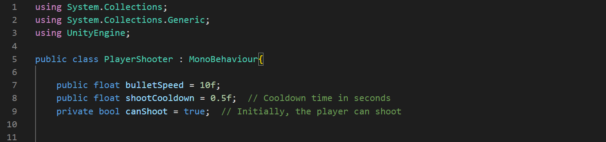

5. The script references a Transform named firePoint, which represents the position where the bullets will be spawned, and a GameObject named bulletPrefab, which is the prefab for the bullets.
    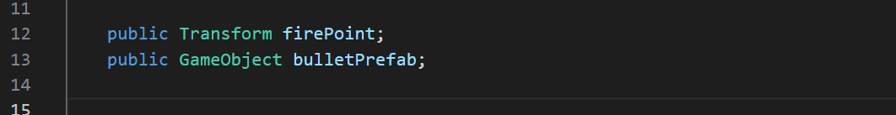

    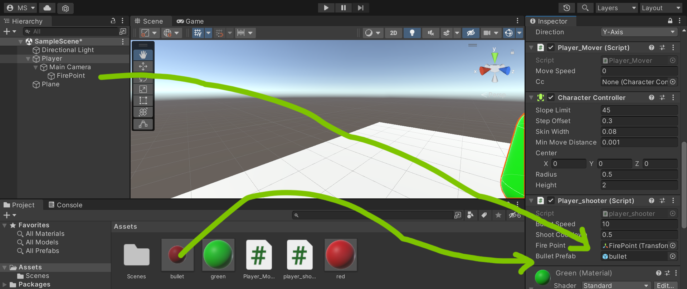

6. In the Update method, it checks if the "Fire1" button (in this case left mouse button) is pressed and if the player is currently allowed to shoot (canShoot is true). If both conditions are met, the Shoot method is called.
    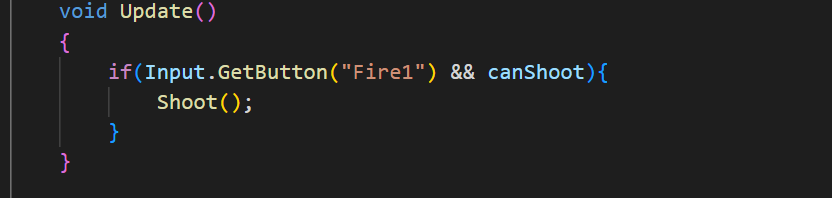

7. Next create a shoot method. In the Shoot method:

    A new bullet instance is created using Instantiate, positioned at firePoint.position with the same rotation as firePoint.
    The bullet's Rigidbody component is accessed, and its velocity is set to move it forward with a speed of bulletSpeed.
    The bullet is scheduled for destruction after a certain time (in this case 2 seconds).
    canShoot is set to false to initiate the shooting cooldown, and StartCoroutine(ShootingCooldown()) is called.
    ShootingCooldown is a coroutine that waits for the specified shootCooldown time before allowing the player to shoot again. This cooldown prevents rapid consecutive shots.

    ``Instantiate`` is a method in Unity used to create instances (copies) of a GameObject or a Prefab at a specified position and with an optional rotation. It's commonly used for spawning objects during runtime.

    ``StartCoroutine`` is a method used to begin the execution of a coroutine
    ``IEnumerator`` is an interface commonly used in Unity to create coroutines. Within these methods, you can use yield statements to specify when and for how long the coroutine should pause and return control to the main game loop.
    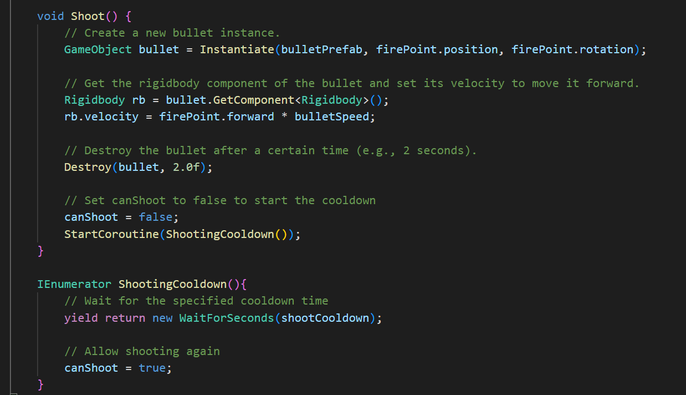