# Unity Introduction

In this meeting we will be discussing about introduction to Unity and Unity basic scripting. Unity is a powerful and popular game development platform that allows you to create interactive 2D and 3D applications, including games, simulations, virtual reality experiences, and more. It's known for its versatility and user-friendly interface, large community support, and cross-platform capabilities. Its accessibility, combined with powerful 2D and 3D capabilities, makes it a top choice for beginners and experienced developers alike. 

## Getting started with Unity

1. **Download and Install Unity**: Visit the Unity website (https://unity.com) to download and install the Unity Hub and Unity Editor.

2. **Create a Unity ID**: You'll need a Unity ID to access Unity services and the Unity Asset Store.

3. **Create a Project**: In this session we will be using Unity 3D (core) project as starter. Follow this step to create a project:
	- Open Unity Hub Application
	- Click "New Project" button
	- Fill out the name and path of the project on your computer
	- Click "Create Project"

### Workspace introduction


Unity's workspace consists of various panels and views. Here's an overview:

1. **Scene View**: This is where you design and arrange your game objects within a scene. You can move, rotate, and scale objects using the Scene View.

2. **Game View**: The Game View shows how your game will look and function in real-time. It's useful for testing and playing your game.

3. **Hierarchy**: The Hierarchy panel lists all the game objects in your scene. You can select and organize objects here.

4. **Inspector**: The Inspector panel displays details and properties of the selected game object or component. You can adjust settings and attach scripts here.

5. **Project**: The Project panel is where you manage your assets, including scripts, textures, models, and more. You can organize your project folders and assets here.

6. **Console**: The Console panel logs messages, errors, and warnings generated by your scripts. It's a crucial tool for debugging.

7. **Toolbar**: The Toolbar provides quick access to common tasks like running your game, saving your project, and more.

### How Unity works?

Unity operates on a component-based architecture, and understanding this basic structure is essential for creating games and interactive experiences:

1. **Game Objects**: Game objects are the fundamental building blocks of your Unity scenes. These objects can represent characters, items, scenery, cameras, lights, and more. Each game object is a container that holds components, which define its behavior and appearance.

   

3. **Components**: Components are individual units of functionality that can be attached to game objects. Unity provides a wide range of built-in components like colliders, rigidbodies, cameras, and lights, but you can also create custom components through scripting. Components define various aspects of a game object, such as its appearance, physics behavior, and interactivity.
   
   

5. **Scripts**: Unity commonly uses C# (or other supported languages like JavaScript or Boo) for scripting. Scripts allow you to add custom logic and behavior to your game objects. You can write scripts to control how a character moves, how enemies behave, how items are collected, and much more. The scripts can be attached to game objects as components.

   

6. **Scenes**: A scene is a container for your game objects. You can think of a scene as a level or a distinct part of your game. You can have multiple scenes in a Unity project, each representing different parts of your game. Scenes help organize and manage the complexity of larger games and interactive applications.

   

## Scripting Tutorial in Unity
### Project Example : First-Person Shooter Game

In this section, we are going to give an example how to do basic scripting in Unity with C# Programming Language. Let's say we want to create a short project / game and the genre of the game is first-person shooter, what should we do first ? Here are the step by step on how to operate Unity with C# as its scripting method inorder to build your first project.

1. **Create a new project** 

   Once you've installed the latest version of Unity Hub, open it and press ``New Project``, you will see a list of templates of unity projects, then choose the 3D Template and rename the project as you wish. After that, press ``Create Project`` and from now on you can work on your project !

   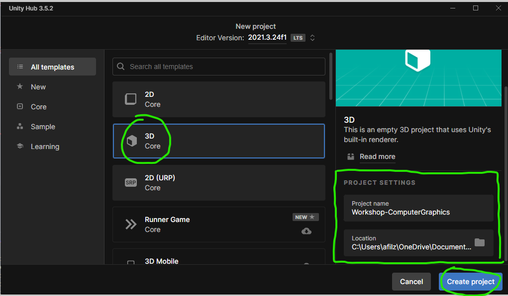
 
2. **Creating Game Objects**

   * After you've created the project, navigate through the ``Hierarchy Window``, you will see 2 objects which is ``Main Camera`` and ``Directional Light``, we should leave that be at first. Then, we want to create a new object by right clicking the Hierarchy Window, press ``3D Objects - Plane``. Planes are often used for creating floors, walls, ceilings, or any other flat surfaces in a    game world. In this context, we want plane as the floor of our player.

      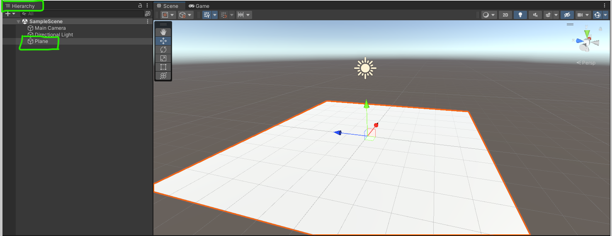

   * The next game object we want to create is a capsule, capsules are commonly used primitive shape in game development, mainly for creating characters, characters' hitboxes, or physical colliders. In this context, we want the capsule as our main player. To create it, right click the hierarchy window then press ``3D Objects - Capsule``.

      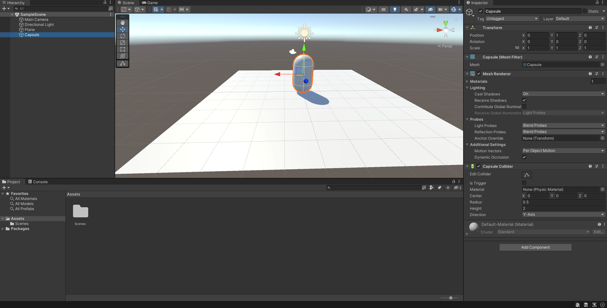

      Make sure to set the position of your capsule's X, Y, and Z inside the ``inspector window`` that is located on the right side. Navigate to ``transform`` component then set the position's value to 0 - 1 - 0. This will make the capsule located right above the plane. In addition, you can also set the capsule's name as you wish, in this case i named it as "Player".

   * You can also change the color of the capsule by creating a new ``material`` in your ``assets window``, right click inside the window then press ``Create - Material``. Next step is to click the material then set the ``albedo`` attribute inside the inspector window, set the color as you wish, i set mine to red.

      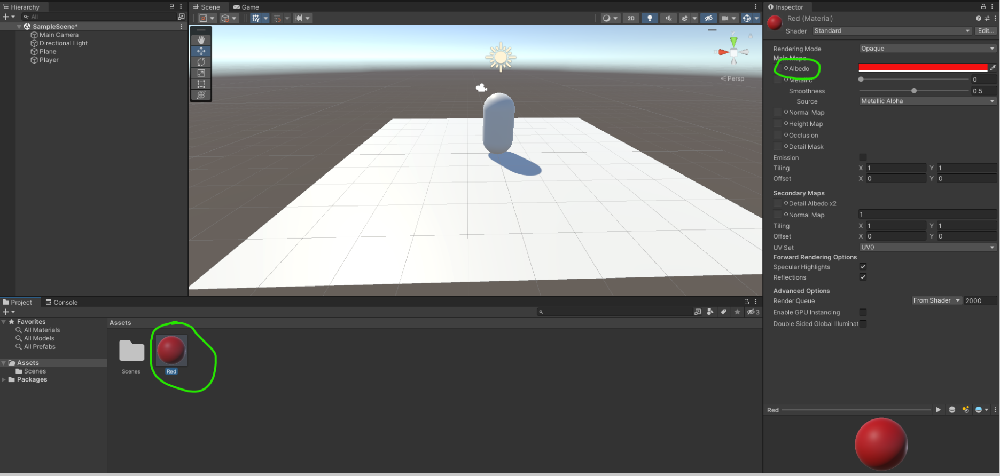

      Then, drag the new material to the capsule inside the ``scene window``, your capsule / player will turn to the color that you chose earlier.

      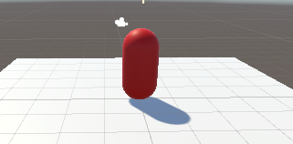

   * Next step, we want to move the main camera inside the player object, by simply dragging the ``main camera`` inside the ``player``, this will make the player also moves when the main camera is moved. Then, set the camera position inside the capsule by simply dragging the xyz axis.

      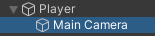

      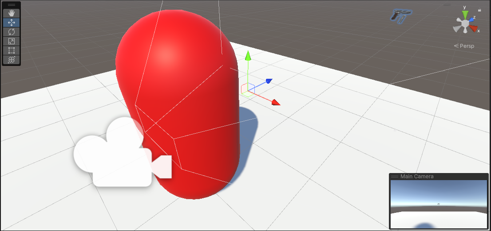

   * Then, we want to create a new object which is a pistol for the main player. We are going to use the available assets from unity, go to this link and press ``Add to my assets``, https://assetstore.unity.com/packages/3d/props/guns/pbr-pistol-33838 . The website will show the prompt to open the assets in unity, after that press ``import``.

      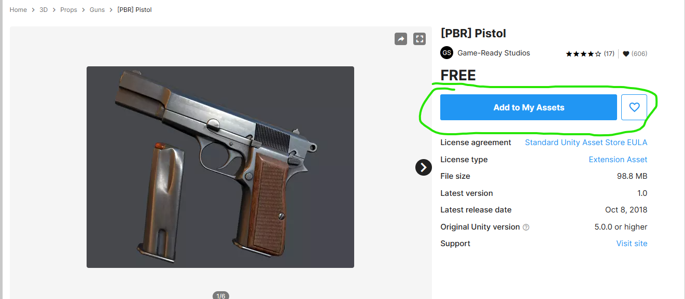

      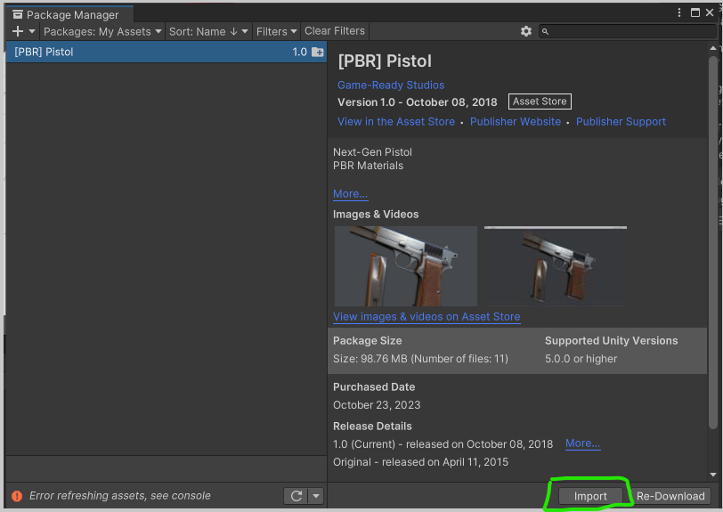

      After you've imported the asset, a new folder called ``pistol`` will be shown in the assets window, navigate to the folder, then drag the pistol ``prefab`` inside the ``main camera``.

      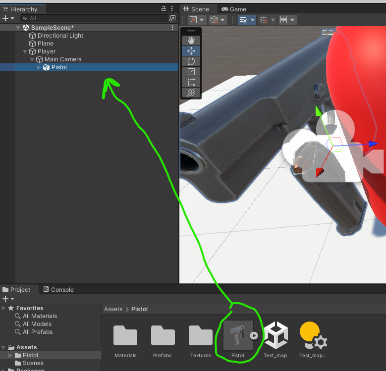

      On the pistol object, unpack the prefab and remove unnecessary objects such as ``bullet``, ``clip``, and ``trigger``.

      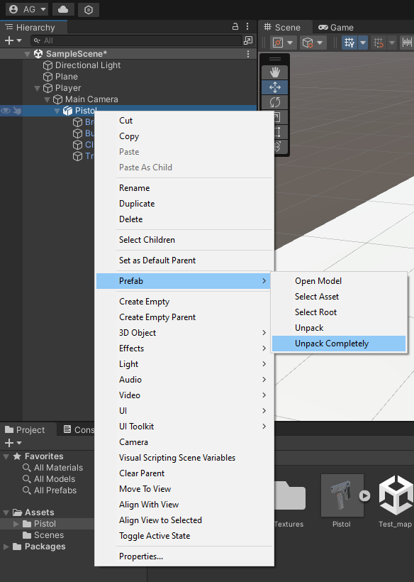
      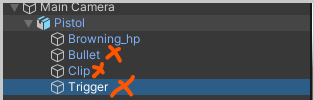

      Then, rescale and reposition the pistol so that it will align with the main camera, just like the image below

      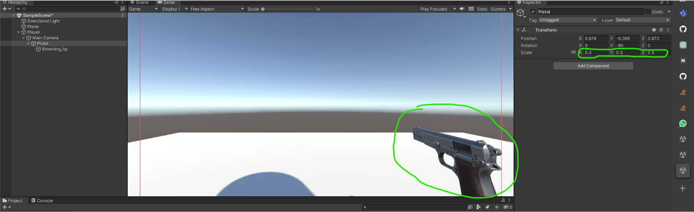

3. **Creating Scripts for Objects**

   ## Make your player move

   1. First you'll need to create a player mover script for your player movement.
   you can do that by clicking the add component button inside the inspector or create a script in the project and then adding that script to the player GameObject.

      

   2. Next open the script by double clicking the script.

   3. Inside the script you'll need to declaring the necessary variables that will control the player's movement. These variables typically include speed or any other factors that affect how the player moves. In this case, we are are only going to use speed.

      

      ``[SerializeField]`` is an attribute in Unity's C# scripting that is used to make a private variable visible in the Unity Inspector, allowing you to set its value from the Unity Editor.

   3. Next add ``CharacterController`` to the player gameObject.

      

   4. Next you need to you should obtain a reference to the ``CharacterController`` component that is attached to the player's GameObject. A CharacterController in Unity is a specialized component used for controlling the movement and physics interactions of a character or game object, typically in a 3D game.

      You can do it with two ways :
      First you can manually attach the component in the unity editor by making the CharacterController a SerializeField.

      

      Second, you can automaticly get the component from your game object using the ``getComponent`` method inside the ``start`` method.

      ``Start():`` Called at the beginning of the first frame when a script is enabled. It's often used for initial setup.

      

   5. Next your script will need to be able to recieve input from the user (in this case keyboard). Using the Input.GetAxis with input vertical and horizontal in the update method you will be able to recieve up down left and right arrow key input from user.

      ``Update():`` Called once per frame and is commonly used for game logic that needs to run continuously (e.g., character movement).

      

      ``Input.GetAxis`` : is a function in Unity that allows you to retrieve the current value of a specified input axis. 
      ``Input.GetAxis("Vertical")`` : retrieves the input from the "Vertical" axis, which is typically mapped to the W and S keys (or the Up and Down arrow keys). 
      ``Input.GetAxis("Horizontal")`` : retrieves the input from the "Horizontal" axis, typically mapped to the A and D keys (or the Left and Right arrow keys).

      ``moveSpeed`` represents the speed at which the game object should move.
      The result of this calculation, stored in the x and z variable. the x represents the desired movement in the left or right direction. the z represents the desired movement in the forward or backward direction.

   6. Next create a method called move (you can named it as you wish). This method will takes a single parameter, dir, which is expected to be a Vector3.

      

   7. using transform.TransformDirection, dir vector will transforms from local space to global space. In Unity, objects have their local coordinate system, but the Move function of a CharacterController typically expects movement input in global space. By using transform.TransformDirection, the dir vector is converted from local to global space, ensuring that movement is applied correctly.

   8. Then multipy the dir by Time.deltaTime. This will makes the movement frame-rate independent, ensuring that the object moves at a consistent rate regardless of the frame rate. 

   Now you should be able to move your player.

   ## Make your player able to look

   * The second script that we are going to create is called ``PlayerLook``, the purpose of this script is to make the player able to move the camera with the mouse. Click on the ``Player`` object then in the inspector window, press ``Add Component`` then type the name of the script.

      

   * Double click the script inside the component, then vscode will pop-up. 

   * First, we want to create a public float variable called `sensitivity`, this will determines the sensitivity of the mouse movement. It scales the mouse input to control how fast the camera responds to the mouse.

   * Then, create a variable called ``player`` that references to the player's transform, which is typically the GameObject this script is attached to.

   * After that, a variable called ``rotationX`` to manage the rotation around the X-axis (vertical rotation)

   * The last variable is called ``playerCam``, the player's transform, which is typically the GameObject this script is attached to. 

   ```cs
   public class PlayerLook : MonoBehaviour
   {
    public float sensitivity = 2.0f;

    public Transform player;

    private float rotationX = 0;

    [SerializeField] private Transform playerCam;
   ```

   * Then, inside the ``Start()`` function, we want to get the transform component from player, lock the cursor, and hide it so that the mouse will be focused to the game window.

   ```cs
   void Start()
    {
        player = GetComponent<Transform>();
        Cursor.lockState = CursorLockMode.Locked;
        Cursor.visible = false;
    }
   ```

   * Lastly, in the ``Update()`` function, we want to get the ``mouseX`` and ``mouseY`` axis from unity axes.

   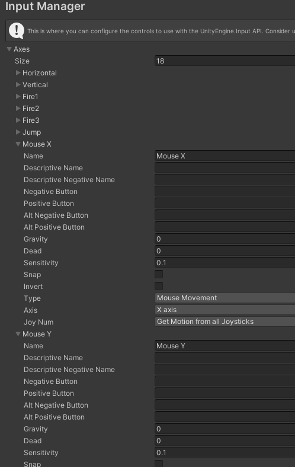

   We can see the name is "Mouse X" and "Mouse Y" so we will get the input and multiply it by our ``sensitivity`` variable. In addition, we want to make the ``Mouse Y`` input to negative, since the upper side of the y axis is negative in unity, so we need to make it positive by doing so.

   ```cs
   float mouseX = Input.GetAxis("Mouse X") * sensitivity;
   float mouseY = - Input.GetAxis("Mouse Y") * sensitivity;   
   ```

   * Then, enable the horizontal camera rotation by rotating the ``player`` variable by its up vector (0, 1, 0) and multiply it by the variable ``mouseX``

   ```cs
   player.Rotate(Vector3.up * mouseX);
   ```

   * For the vertical camera rotation, the first thing that we want to do is to increment the variable ``rotationX`` with the variable ``mouseY``, then clamp the vertical tilt from range ``-90 to 90``. Lastly, apply the vertical rotation to the camera by using ``Quaternion.Euler`` that represents the vertical rotation. This will rotate the camera vertically while keeping the horizontal rotation unchanged.

   ```cs
   rotationX += mouseY;
   rotationX = Mathf.Clamp(rotationX, -90, 90);
   playerCam.localRotation = Quaternion.Euler(rotationX, 0, 0);
   ```

   ## Make your player able to shoot

   1. First create a sphere object for bullet gameObject in the hierarcy and give a red color to it by using material like before. After that resize the bullet to 0.1 or another size that you seem fit.
      

      

      After that put the bullet gameObject to the hierarchy by dragging the gameObject. You will have a prefab for bullet gameObject. In that way you can clone that object as much as you want without having to create the same gameObject all over again.

      

   2. Next you'll need to create a transform position for your bullet to spawn. Put the transform gameObject inside the main Camera gameObject and set the position to align with  the muzzle of the pistol.

      
      

   3. Next create a script PlayerShooter in the palyer gameObject. The script is responsible for managing the shooting behavior of the player character.

      

   4. Next declare the variable for the behavior of the shot. BulletSpeed (the speed of the bullets), shootCooldown (the time delay between shots), and a private boolean canShoot to track whether the player is allowed to shoot.
      

   5. The script references a Transform named firePoint, which represents the position where the bullets will be spawned, and a GameObject named bulletPrefab, which is the prefab for the bullets.
      

      

   6. In the Update method, it checks if the "Fire1" button (in this case left mouse button) is pressed and if the player is currently allowed to shoot (canShoot is true). If both conditions are met, the Shoot method is called.
      

   7. Next create a shoot method. In the Shoot method:

      A new bullet instance is created using Instantiate, positioned at firePoint.position with the same rotation as firePoint.
      The bullet's Rigidbody component is accessed, and its velocity is set to move it forward with a speed of bulletSpeed.
      The bullet is scheduled for destruction after a certain time (in this case 2 seconds).
      canShoot is set to false to initiate the shooting cooldown, and StartCoroutine(ShootingCooldown()) is called.
      ShootingCooldown is a coroutine that waits for the specified shootCooldown time before allowing the player to shoot again. This cooldown prevents rapid consecutive shots.

      ``Instantiate`` is a method in Unity used to create instances (copies) of a GameObject or a Prefab at a specified position and with an optional rotation. It's commonly used for spawning objects during runtime.

      ``StartCoroutine`` is a method used to begin the execution of a coroutine
      
      ``IEnumerator`` is an interface commonly used in Unity to create coroutines. Within these methods, you can use yield statements to specify when and for how long the coroutine should pause and return control to the main game loop.
      

